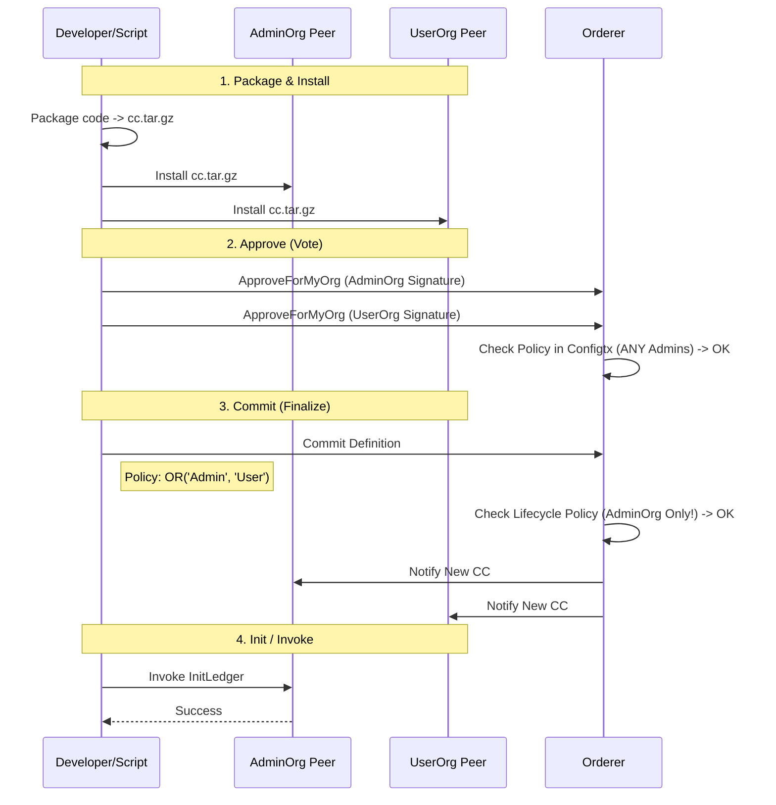

# Chaincode Lifecycle Flow (Fabric 2.x)

Quy trình cài đặt và kích hoạt smart contract. Quy trình này phân quyền rất chặt chẽ (Decentralized Governance).

## Quy trình 4 Bước

## Giải thích chi tiết
1.  **Network Logic:** Chaincode không "được cài" lên mạng, nó được cài lên từng Peer.
2.  **Approve:** Mỗi tổ chức phải tự "ký nháy" (Approve) vào definition (tên, version, sequence ID) để đồng ý chạy nó.
3.  **Commit:** Đây là bước "ký chính thức". Trong mạng Docube, chỉ **AdminOrg** mới có quyền gửi lệnh Commit này (do cấu hình `LifecycleEndorsement`). Nếu UserOrg tự ý commit, Orderer sẽ từ chối.
4.  **Endorsement Policy:** Được định nghĩa lúc Approve/Commit. `OR('Admin', 'User')` nghĩa là sau này giao dịch chỉ cần 1 trong 2 chữ ký là hợp lệ.
