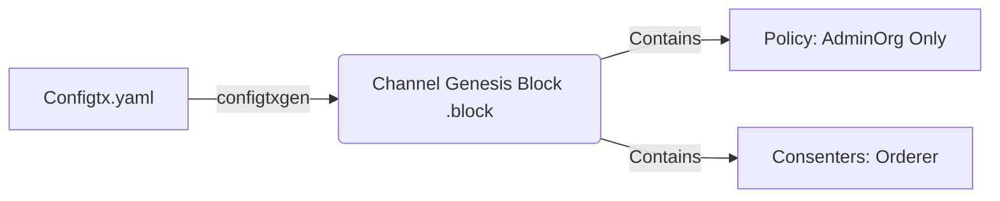
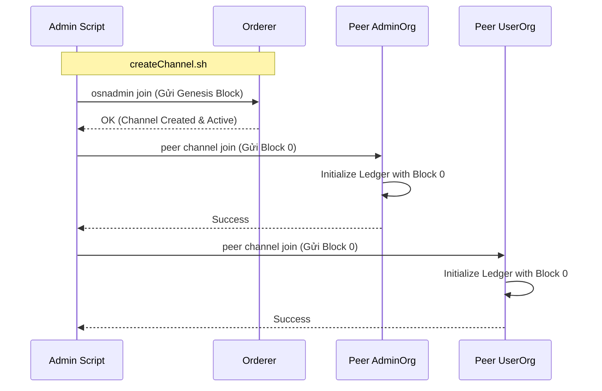

# Channel Creation Flow

Mô tả quá trình tạo "đường ống riêng" (channel) và đưa các peer vào đó.

## 1. Create Genesis Block
**Công cụ:** `configtxgen`
**Input:** `configtx.yaml`

## 2. Join Channel (Orderer & Peers)
**Công cụ:** `osnadmin`, `peer channel join`

## Giải thích biến quan trọng
*   `BLOCKFILE`: File nhị phân chứa cấu hình khởi tạo channel.
*   `osnadmin`: Công cụ mới (Fabric v2.3+) để quản lý channel trên Orderer mà không cần system channel.
*   `peer channel join`: Lệnh bắt buộc để peer biết sự tồn tại của channel và bắt đầu đồng bộ block từ Orderer.
