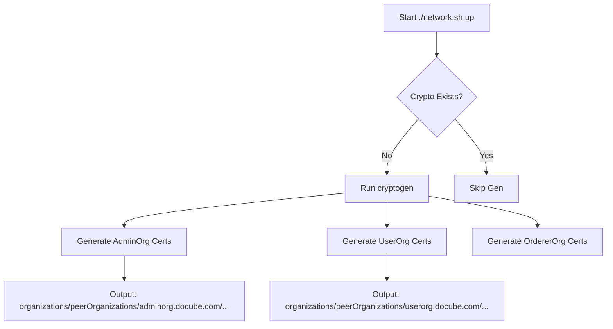
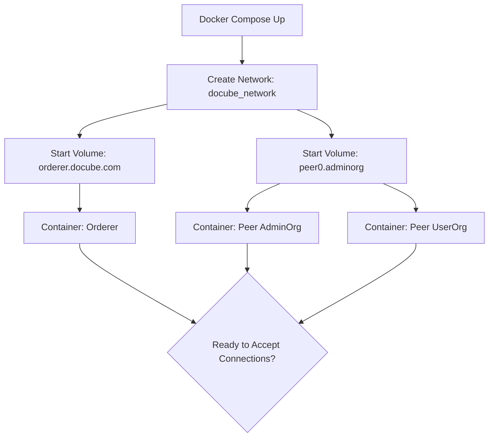

# Network Startup Flow

Mô tả quá trình khởi động mạng Docube từ con số 0.

## 1. Crypto Generation (Sinh danh tính)
**Công cụ:** `cryptogen`
**Input:** `crypto-config-*.yaml`

## 2. Docker Containers Start
**Công cụ:** `docker-compose`
**Input:** `compose-docube-net.yaml`

## Giải thích chi tiết
1.  **Crypto Gen:** Tạo ra X.509 Certificates (Public/Private Key) cho từng node và user. Đây là bước quan trọng nhất để thiết lập danh tính (Identity).
2.  **Container Start:**
    *   **Orderer:** Khởi động, đọc config, sẵn sàng nhận request tạo channel.
    *   **Peers:** Khởi động, load MSP từ volumes, kết nối gossip (nếu có), mở port 7051/9051 chờ lệnh.
