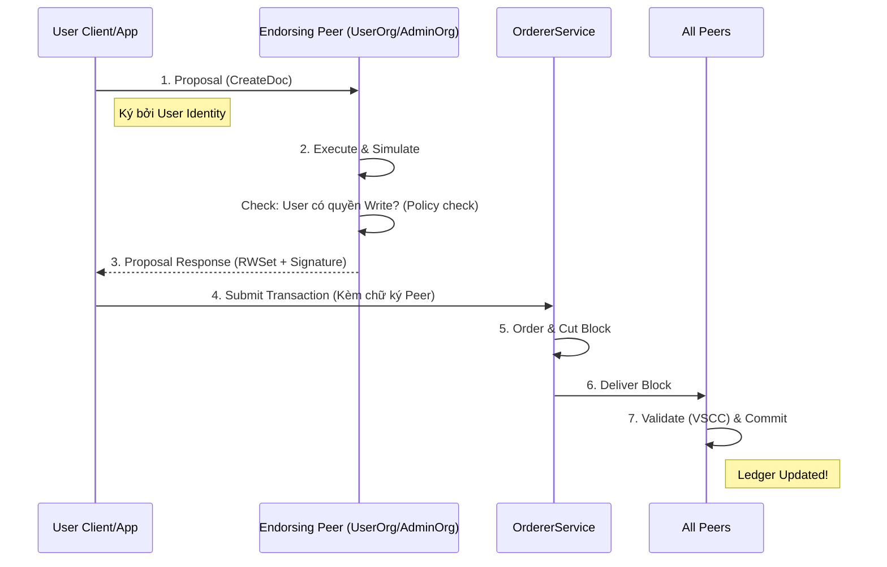
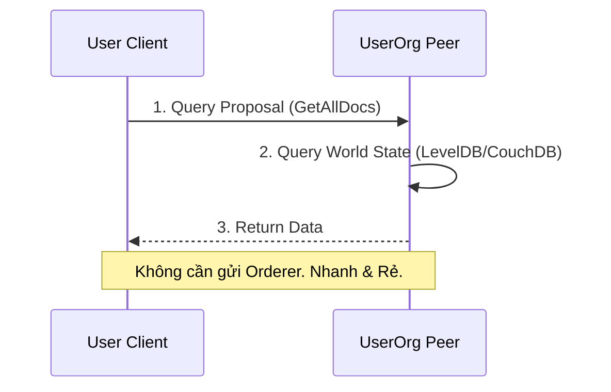

# Transaction Flow (Write & Query)

Làm thế nào dữ liệu đi từ User vào Ledger?

## 1. Write Transaction (Ghi dữ liệu/Invoke)

## 2. Query Transaction (Đọc dữ liệu)

## Điểm nhấn bảo mật
*   **Write:** Cần chữ ký của Peer (Endorsement) để chứng minh transaction hợp lệ theo business logic.
*   **Read:** Chỉ cần hỏi Peer của chính mình, không lộ thông tin query ra ngoài mạng (Privacy).
